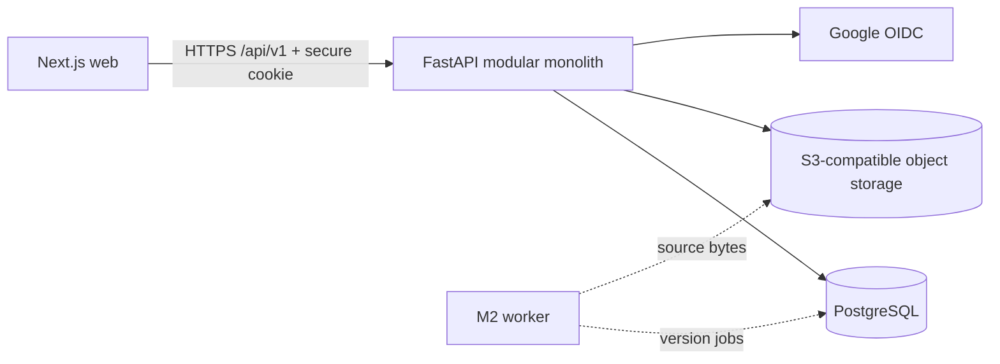

# ReadySet M1 architecture

## System shape

ReadySet is a modular monolith in a monorepo. `apps/api` is the sole owner of business rules and PostgreSQL. `apps/web` is an independently deployable Next.js client. `apps/worker` records the intended M2 deployment boundary but contains no premature queue runtime. Object bytes are accessed only through the API's storage port.

## Backend modules

- `auth`: users, provider identities, password credentials, sessions, verification/reset flows, Google OIDC.
- `organizations`: organizations, membership, invitations, active-organization resolution, role capabilities.
- `people`: employee profiles, teams, team memberships.
- `documents`: logical documents, immutable versions, access grants, storage operations.
- `audit`: append-oriented actor/resource records.
- `common`: database, request context, errors, settings, and shared pagination.

Routes validate transport data, resolve an authenticated organization context, and call services. Services enforce use-case policy and transaction boundaries. Repositories always accept organization context for tenant-owned data. ORM models are infrastructure and are never shared with the frontend.

## Tenant request path

1. The opaque session cookie is hashed and resolved to an active session and `User`.
2. The requested organization comes from `X-ReadySet-Organization` or an unambiguous single active membership.
3. The API loads an active `OrganizationMembership`; client-provided organization/user IDs never establish authority.
4. `OrganizationContext` carries actor, organization, membership, and derived capabilities.
5. Repository predicates include `organization_id`; document reads additionally include the ACL predicate.
6. Missing/cross-tenant objects return `404` to reduce enumeration signals. Insufficient action on a visible in-tenant object returns `403`.

## Deployment and evolution

The API and web build separately. PostgreSQL and S3-compatible storage are required production dependencies. Docker Compose supplies PostgreSQL and MinIO locally. M2 may deploy `apps/worker` from the same codebase and add version-scoped ingestion jobs without splitting services or changing the document identity model.

## Explicit non-goals

M1 has no RAG, embeddings, chunks, connector sync, courses, onboarding enrollment/plans/tasks, AI conversations, Kafka, Temporal, Kubernetes, or microservices.
