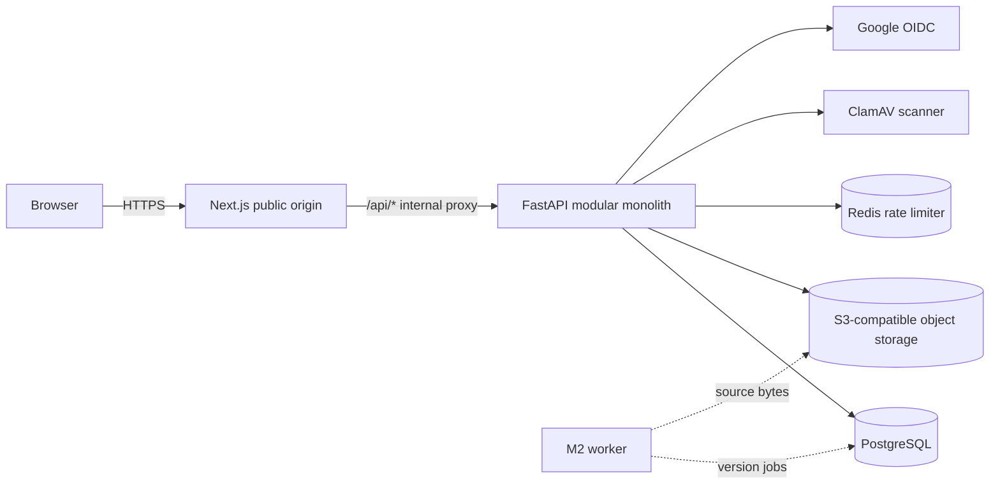

# ReadySet M1 architecture

## System shape

ReadySet is a modular monolith in a monorepo. `apps/api` is the sole owner of business rules and PostgreSQL. `apps/web` is an independently deployable Next.js client. `apps/worker` records the intended M2 deployment boundary but contains no premature queue runtime. Object bytes are accessed only through the API's storage port.

## Backend modules

- `auth`: users, provider identities, password credentials, sessions, verification/reset flows, Google OIDC.
- `organizations`: organizations, membership, invitations, active-organization resolution, role capabilities.
- `people`: employee profiles, teams, team memberships.
- `documents`: logical documents, application-immutable source versions, access grants, validation/scanning, storage operations.
- `audit`: append-oriented actor/resource records.
- shared infrastructure modules: database/session dependencies, configuration, policy, rate limiting, storage, email, security helpers, and typed schemas.

This is deliberately a small modular monolith, not a ceremonial service/repository stack. Route modules currently contain transport handling and cohesive application/transaction logic. Central policy and dependency modules enforce authentication, tenant context, CSRF, and capabilities; the document policy query centralizes ACL-sensitive lookup. Storage and email sit behind ports. Repeated or security-sensitive data access should be extracted when it gains a real second consumer, but simple CRUD does not require an interface. ORM models never cross the API boundary; the web client uses generated OpenAPI types.

## Tenant request path

1. The opaque session cookie is hashed and resolved to an active session, its creating `AuthIdentity`, and an active `User`; the identity must still be valid and password identities must remain verified.
2. The requested organization comes from `X-ReadySet-Organization` or an unambiguous single active membership.
3. The API loads an active `OrganizationMembership`; client-provided organization/user IDs never establish authority.
4. `OrganizationContext` carries actor, organization, membership, and derived capabilities.
5. Repository predicates include `organization_id`; document reads additionally include the ACL predicate.
6. Missing/cross-tenant objects return `404` to reduce enumeration signals. Insufficient action on a visible in-tenant object returns `403`.

## Deployment and evolution

The API and web build separately. The public topology is one host: `https://app.readyset.example` serves Next.js and proxies `/api/*` to the private FastAPI origin. The public Google callback is therefore `https://app.readyset.example/api/v1/auth/google/callback`. Session, CSRF, and OAuth-binding cookies are host-only; no broad cookie domain is configured. `PUBLIC_WEB_URL` is public, while `API_INTERNAL_URL` is a build-time/server-side Next.js proxy target and is never exposed to the browser.

PostgreSQL, private S3-compatible storage, Redis, malware scanning while uploads are enabled, and SMTP for password/invitation delivery are required production dependencies. Docker Compose supplies PostgreSQL, MinIO, and Redis locally; development uses an explicit no-op scanner. One release job runs Alembic before non-root API replicas start. M2 may deploy `apps/worker` from the same codebase and add version-scoped ingestion jobs without splitting services or changing the document identity model.

## Explicit non-goals

M1 has no RAG, embeddings, chunks, connector sync, courses, onboarding enrollment/plans/tasks, AI conversations, Kafka, Temporal, Kubernetes, or microservices.
