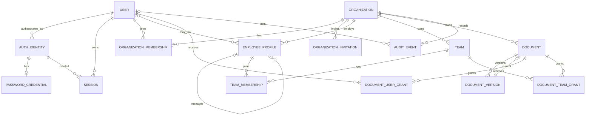

# Database architecture

## Entity responsibilities

- `users`, `auth_identities`, `password_credentials`, `sessions`, `one_time_tokens`, `oauth_login_states`: authentication and account security. Verification and reset tokens share `one_time_tokens` and are distinguished by `purpose`.
- `organizations`, `organization_memberships`, `organization_invitations`: tenant ownership and access.
- `employee_profiles`, `teams`, `team_memberships`: organization people directory.
- `documents`, `document_versions`, `document_user_grants`, `document_team_grants`: logical knowledge items, application-immutable source identities, and ACLs.
- `audit_events`: append-oriented security/product activity.

## ER diagram

## Tenant ownership paths

| Table | Ownership path |
|---|---|
| organization memberships/invitations | direct `organization_id` |
| employee profiles and teams | direct `organization_id` |
| team memberships | direct `organization_id` plus team/profile FKs |
| documents and versions | direct `organization_id`; version also belongs to document |
| document grants | direct `organization_id` plus document and principal FK |
| audit events | direct `organization_id` (nullable only for account-level auth events) |
| users/auth identities/sessions/tokens | global account scope, never tenant-owned |

Duplicated `organization_id` on joins and versions is intentional: it enables mandatory scoped queries and composite integrity constraints instead of trusting a multi-hop application inference.

## Constraints and indexes

- UUID primary keys use application-generated UUIDv4 values.
- Normalized primary email is unique; `(provider, provider_subject)` is unique.
- `(organization_id, user_id)` membership, `(organization_id, slug)` team, and `(team_id, employee_profile_id)` membership are unique.
- Partial unique indexes permit at most one active OWNER per organization and one pending invitation per organization/normalized email. Application transactions preserve the complementary rule that an organization always has an active owner; PostgreSQL cannot express that minimum-cardinality rule with a simple constraint.
- Employee `(organization_id, user_id)` is unique when a user link exists.
- `(document_id, version_number)`, `(organization_id, document_id, id)`, and `storage_key` are unique. The document current pointer uses `(organization_id, id, current_version_id)` to reference `(organization_id, document_id, id)`, proving the version belongs to that document.
- Document grant pairs are unique and use concrete FKs.
- Composite organization/id FKs ensure profiles, teams, documents, versions, and grants cannot be joined across tenants. Tenant-owned user principals and grant/invitation creators reference `(organization_id, user_id)` membership rows; membership may be revoked for history, while application authorization still requires ACTIVE status.
- Common list indexes begin with `organization_id`; session/token hashes and invitation token hashes are uniquely indexed; audit events index organization/time and resource.
- Check constraints enforce positive version numbers and non-negative sizes. Token expiry and purpose semantics are enforced by application queries; there is no database claim that wall-clock expiry is a static check constraint.

## Delete behavior

Users and organizations are not hard-deleted through M1 APIs. Membership revocation changes status and immediately invalidates organization access. Deleting a team cascades team membership and team document grants; it does not delete people or documents. Documents are archived; source versions remain for audit/reproducibility. Expired sessions/tokens may be hard-deleted by maintenance. No public API updates or deletes audit events; application writes are append-oriented, while privileged database/migration roles retain modification ability.

## Migration strategy

Alembic is the only production schema-change path. The published initial migration `d24151675ee0` is unchanged. Corrective revision `a42f85c9d319` deletes untrusted legacy sessions/OAuth states, adds identity/browser binding, repairs and strengthens current-version integrity, adds membership principal FKs, deduplicates legacy owner/invitation conflicts, and installs partial unique indexes. Additive revision `f6f5b16f7d31` converts the two flexible metadata columns from JSON to PostgreSQL JSONB. Migrations are tested from an empty PostgreSQL database in CI; destructive changes use expand/migrate/contract once production data exists.

Document version creation locks the parent document row with `FOR UPDATE` before calculating `MAX(version_number)+1`, so uploads for the same document serialize. Different documents remain independent.

## Intentionally deferred fields and M2 extensions

No salary, address, HRIS payload, custom role engine, connector, chunk, embedding, parser configuration, or vector column is included. M2 can add `ingestion_jobs`, `extracted_artifacts`, `document_chunks(document_version_id, ...)`, index records, connector/source bindings, and external ACL principals. Citations store `document_version_id` and chunk identifiers.
