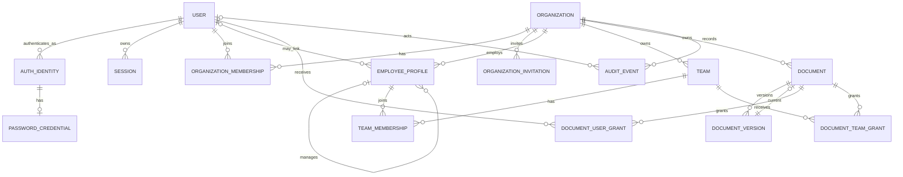

# Database architecture

## Entity responsibilities

- `users`, `auth_identities`, `password_credentials`, `sessions`, `email_verification_tokens`, `password_reset_tokens`, `oauth_login_states`: authentication and account security.
- `organizations`, `organization_memberships`, `organization_invitations`: tenant ownership and access.
- `employee_profiles`, `teams`, `team_memberships`: organization people directory.
- `documents`, `document_versions`, `document_user_grants`, `document_team_grants`: logical knowledge items, immutable source versions, and ACLs.
- `audit_events`: append-oriented security/product activity.

## ER diagram

## Tenant ownership paths

| Table | Ownership path |
|---|---|
| organization memberships/invitations | direct `organization_id` |
| employee profiles and teams | direct `organization_id` |
| team memberships | direct `organization_id` plus team/profile FKs |
| documents and versions | direct `organization_id`; version also belongs to document |
| document grants | direct `organization_id` plus document and principal FK |
| audit events | direct `organization_id` (nullable only for account-level auth events) |
| users/auth identities/sessions/tokens | global account scope, never tenant-owned |

Duplicated `organization_id` on joins and versions is intentional: it enables mandatory scoped queries and composite integrity constraints instead of trusting a multi-hop application inference.

## Constraints and indexes

- UUID primary keys use application-generated UUIDv4 values.
- Normalized primary email is unique; `(provider, provider_subject)` is unique.
- `(organization_id, user_id)` membership, `(organization_id, slug)` team, and `(team_id, employee_profile_id)` membership are unique.
- Employee `(organization_id, user_id)` is unique when a user link exists.
- `(document_id, version_number)` and `storage_key` are unique.
- Document grant pairs are unique and use concrete FKs.
- Composite organization/id FKs ensure profiles, teams, documents, versions, and grants cannot be joined across tenants.
- Common list indexes begin with `organization_id`; session/token hashes and invitation token hashes are uniquely indexed; audit events index organization/time and resource.
- Check constraints enforce positive version numbers/sizes and token expiry semantics where practical.

## Delete behavior

Users and organizations are not hard-deleted through M1 APIs. Membership revocation changes status and immediately invalidates organization access. Deleting a team cascades team membership and team document grants; it never deletes people or documents. Documents are archived; source versions remain for audit/reproducibility. Expired sessions/tokens may be hard-deleted by maintenance. Audit events are append-only.

## Migration strategy

Alembic is the only production schema-change path. Migrations are forward-only, reviewed alongside models, tested from an empty database, and must not import demo migrations. Destructive changes use expand/migrate/contract once production data exists.

## Intentionally deferred fields and M2 extensions

No salary, address, HRIS payload, custom role engine, connector, chunk, embedding, parser configuration, or vector column is included. M2 can add `ingestion_jobs`, `extracted_artifacts`, `document_chunks(document_version_id, ...)`, index records, connector/source bindings, and external ACL principals. Citations store `document_version_id` and chunk identifiers.
